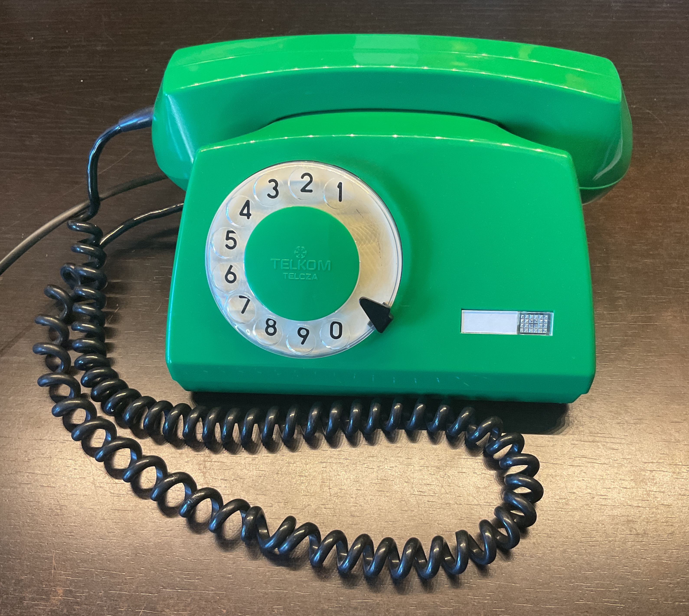
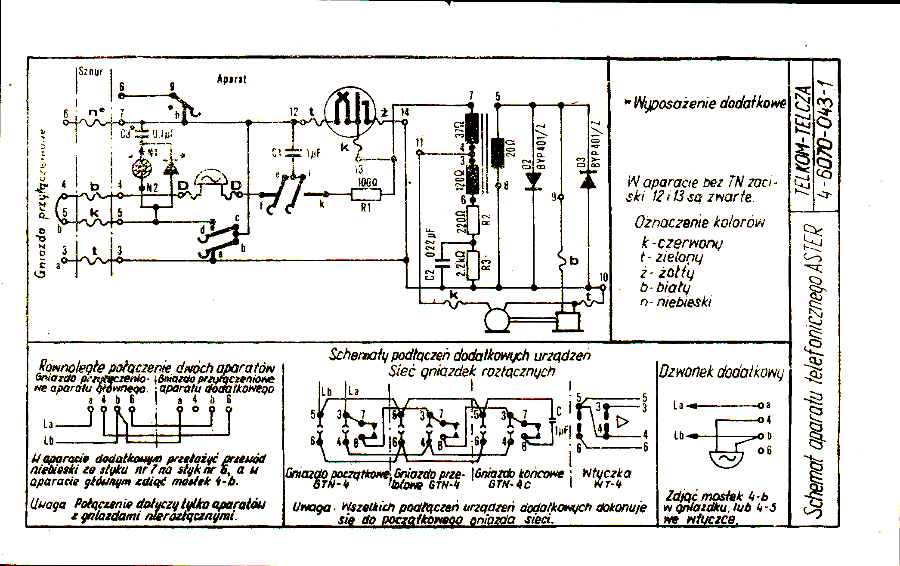
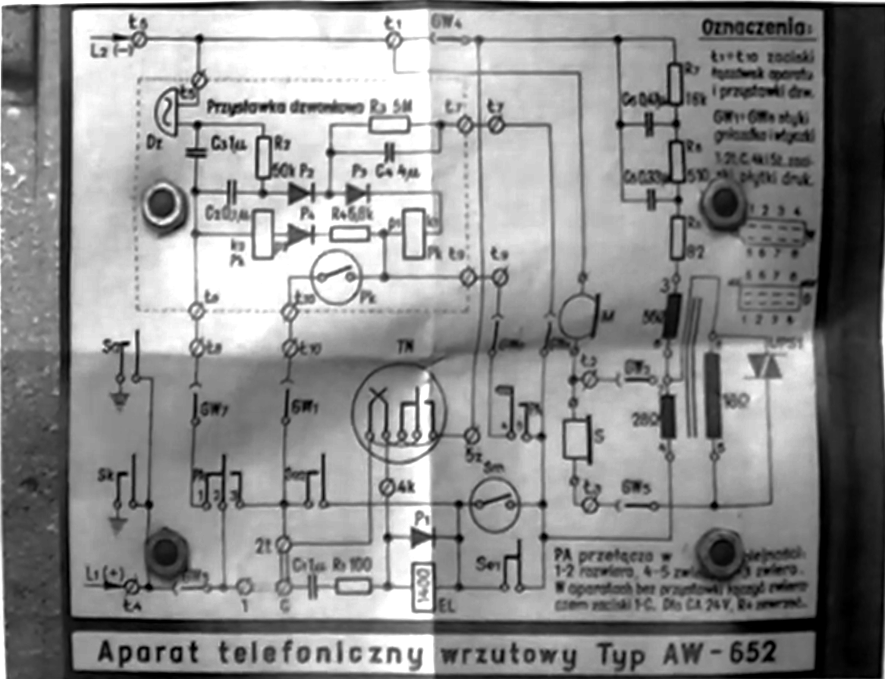

# Plane Old Telephone Service devices

## Pulse Dial Phones

Schematics and notes.

### Polish TELEKOM TELCZA Aster/A

### Old Polish payphone AW-652

References:

- Marcin Marciniak on YouTube [https://www.youtube.com/watch?v=UMcaoPy4UzA](https://www.youtube.com/watch?v=UMcaoPy4UzA)

## DTMF Dial Phones

