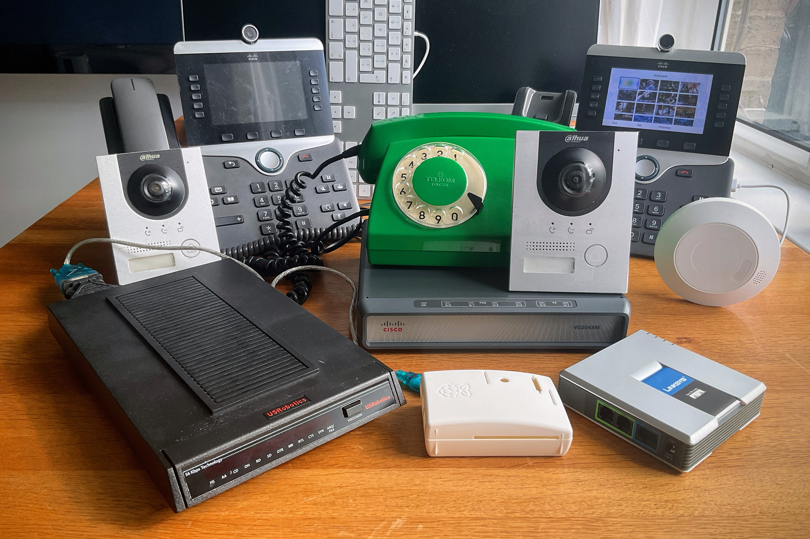
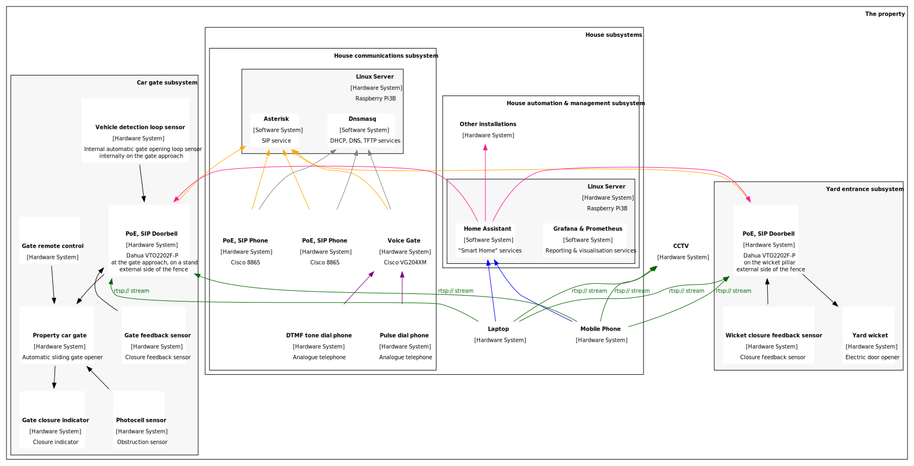

# Home(Lab) VoIP network
Raspberry Pi Asterisk SIP and Cisco VG204XM Voice Gate supporting VoIP with Cisco 8865 and pulse dial phones, modem dialup love, fax, Dahua DHI-VTO2202F-P doorbell. Configuration, deployment, automation and features (paging, intercom, gate opening...)

# Project goal
Deploy a house-wide / multi-room / small office / home-lab video capable VoIP network for internal and external communication and automation.

## Requirements

- The deployment shall be self-contained and fully offline capable
- The infrastructure shall be provisioned in Infrastructure as Code fashion (Ansible)
- Solution shall not require external SIP provider
- Solution shall be capable of integrating with external SIP provider
- Solution shall be capable of soft phone support
- Solution shall be capable of instant messaging (text messaging for supporting clients)
- Solution shall be capable of integrating with Analog Voice Gateway / VoIP Analog Telephone Adapter (ATA) to support analogue phones on the network
- Solution shall be capable of text-to-speach (TTS) and integrating as notification system
- Telephone network shall support both, Pulse and DTMF, dialling standards
- Video VoIP doorbell shall be deployed on the network and integrated with the phone system allowing to interact with person at the entrance from any terminal in the house
- Video VoIP doorbell shall be accessable as instant, 24/7 video stream on the network
- Solution shall provision for fax support
- Solution shall provision for Dial-up modem (PPP) connectivity
- Home Assistant integration shall be possible
- Grafana and Prometheus monitoring shall be implemented

# Hardware
- Raspberry Pi 3B
- [Cisco VG204XM (4 analogue lines, pulse dialling, DTMF)](VG204XM.md)
- [Linksys PAP2T (2 analogue lines, DTMF only)](PAP2T.md)
- [Cisco 8865 phones](8800.md)
- [Dahua DHI-VTO2202F-P 2MP IP Door Station](VTO2202F-P.md)
- [Pulse dial phones](POTS.md#pulse-dial-phones)
- [DTMF phones](POTS.md#dtmf-dial-phones)
- US Robotix Courier modem (dial-up traffic)
- PoE capable switch

## Pulse & DTMF dialling capable ATAs an Voice Gates
References: [List of Pulse dialling Capable ATAs and Hardware](https://www.classicrotaryphones.com/forum/index.php?topic=20386.0)

[VG204XM setup details](VG204XM.md)

- Audio Codes MP-114 FXO
- Cisco VG202 (2 Ports)
- Cisco VG204 (4 Ports)
- Cisco VG202XM (2 Ports)
- Cisco VG204XM (4 Ports)
- Cisco VG224 (24 Ports)
- Cisco VG248 (48 Ports)
- Cisco VG310 (24 Analog FXS ports)
- Digium IAXy s101I
- Dinstar DAG1000-4S4O *
- Dinstar DAG1000-8S8O (Untested, Should work.)
- Draytek VigorTalk ATA-24
- Grandstream GXW-4004 (4 Ports)
- Grandstream GXW-4008 (8 Ports)
- Grandstream GXW-4216 (16 Ports)
- Grandstream GXW-4224 (32 Ports)
- Grandstream GXW-4248 (48 Ports)
- Grandstream HT502 (2 Telephone Ports)
- Grandstream HT503 (1 Telephone Port, 1 CO Port)
- Grandstream HT704 (4 Telephone Ports) **
- Grandstream HT701 (1 Telephone Port)
- Grandstream HT702 (2 Telephone Ports, current firmware)
- Grandstream HT801
- Grandstream HT802 (2 Telephone Ports with in-call DTMF, current firmware)
- Grandstream HT812 (2 Telephone Ports with in-call DTMF, current firmware)
- Grandstream HT414 (4-port FXS)
- Grandstream HT818 (8-port FXS)
- Innomedia MTA6328-2Re
- Linksys RTP300 (Before Firmware Version 3)
- Minitar MVA11A
- Motorola VT-1005
- Primus Lingo iAN-02EX
- UTStartCom iAN-02EX

\*) Works but In-call DTMF Generation is very weird, I don't 100% recommend but other then that it's a decent ATA that puts a nice 4 REN on the line and works with NEON MWI! FXO Outpulsing in Pulse works great. Good for an SxS switch to get on NPSTN or C\*NET.

\*\*) Untested Should work, according to Grandstream

## DTMF only ATAs
According to people who do own multiple devices - "It's all the same device" (with some web UI changes and outer shell). Same electronics running it since ~1996. [Cathode Ray Dude YouTube](https://youtu.be/dEEddujTlog?si=q3NiZNms80uWjQFK&t=1102)

[PAP2T setup details](PAP2T.md)

- Sipura SPA3000
- Sipura SPA2100
- Linksys SPA2100
- Linksys SPA2102
- Linksys PAP2T
- Cisco SPA2102
- Cisco SPA122
- Cisco ATA 199

## Pulse dialling phones

[A few details on internals of a simple pulse-dial telephone](POTS.md)

# Software
- Raspberry Pi OS Lite (Debian Trixie )
- Asterisk 23.2.2 from source (CLI only => no User Interface)
  - HTTP server
  - IAX Modem for Fax-over-IP
- Dnsmasq
  - DHCP server
  - TFTP server
- XML Cisco 8800 series configuration files

# High Level View

## Plain Old Telephone Service (POTS)
To enable analogue telephones to take part in this very digital environment we need a way to create an environment that will allow the phones to participate as they ware connected to a telephone service coming from a regular telco. To do this we can use:

- Voice Gateway [Cisco VG204XM](VG204XM.md)
- Analog Telephone Adapter (ATA) [Linksys PAP2T](PAP2T.md)

[Cisco VG204XM](VG204XM.md) instructions are quite universal. While they do reference Voice Gateway directly it is easy to transpose those to any Cisco IOS running device.

## SIP phones
[Cisco VoIP phones](8800.md) to work and connect require a whole range of devices to admin and configure the environment they interact with. Sadly while most of manuals focus on proprietary solutions, in this document, I am soly focussing on what those phones receive and how to deliver it while usin open source alternatives - XML configuration files served from a TFTP server, network settings done with DHCP Server (IP, Network Mask, Network Gateway, TFTP Server IP),...

# Definitions & notes
## Asterisk
Open source signalling software for SIP phones from [asterisk.org](https://www.asterisk.org/)

## Managed PoE switch
I recommend to look for a switch capable of providing 802.3at PowerMode to provide enough power to your endpoints. Netgear GS110TPv3 worked great for me (v3 => IEEE802.3at capable of delivering up to 30W PoE+; v2 => IEEE802.3af capable of delivering up to 15.4W PoE)

Side note: 8865 has 2 USB ports capable of mobile phone charging. If you want to charge your mobile of your desk phone - remember thais will "cost" you minimum additional 5000mW on PoE port.

## VoIP / SIP phone
Any Voice over IP phone with a capability to work within SIP network

## Soft Phone
A mobile phone app / computer SIP application. A virtual phone.

