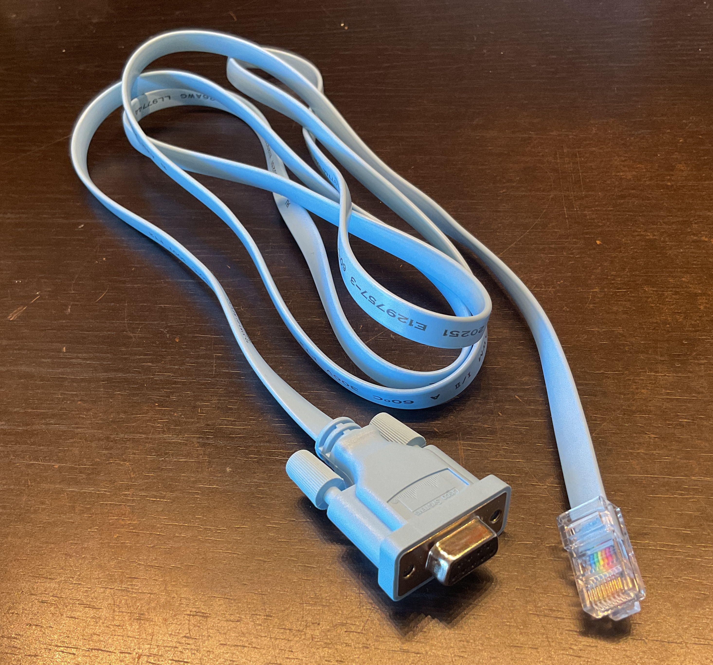
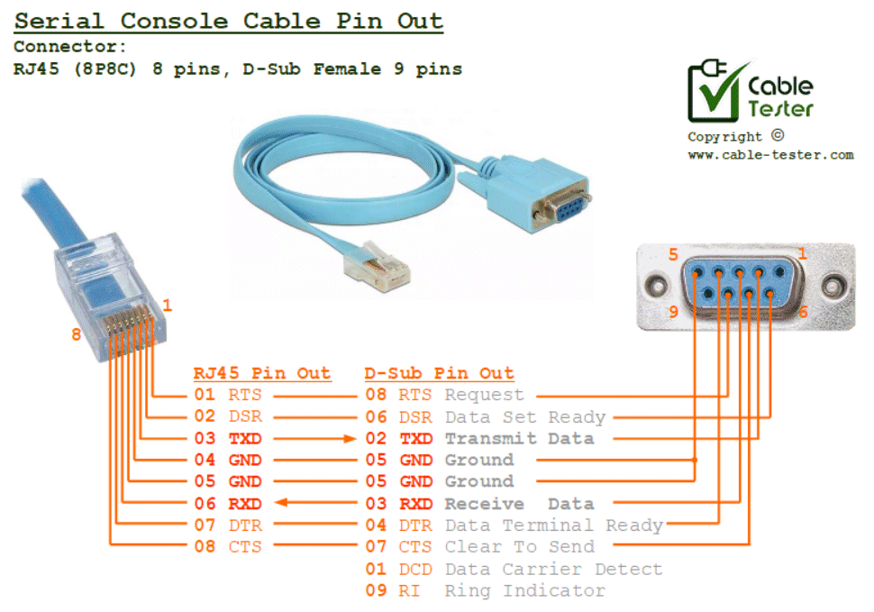
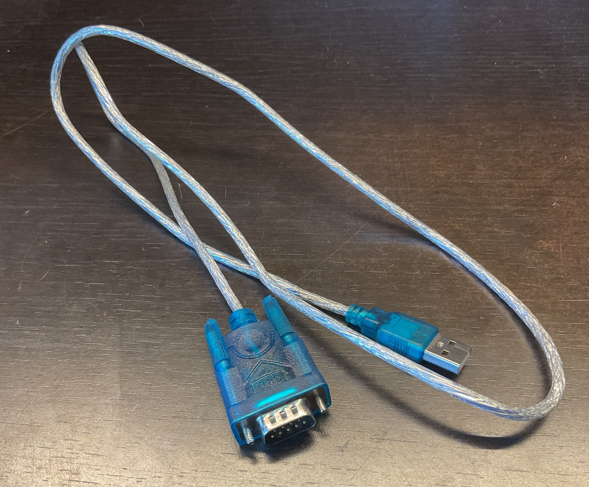
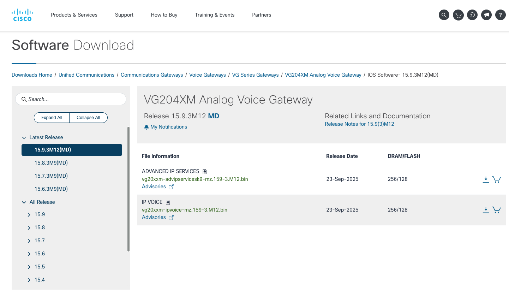

# Cisco VG204XM Voice Gate configuration
Following configurations can be useful in various scenarios and can vary on the user needs. While not all of them are necessary, my goal is to explain benefits, drawbacks and consequences of these features. The set that follows caught my attention while working on my setup.

# Cisco IOS commands for Cisco VG202XM, VG204XM Voice Gateways (VG224, VG248 probably too)
Cisco VG202XM and VG204XM are a newer iteration on Cisco VG202 and VG204 Voice Gateways and for the purpose of this document we can treat them as the same item. VG224, VG248, VG300 and even VG400 series with much larger banks of ports are similar but personally I don't own one therefore I can't reliably say where similarities end.


# Prerequisites - external supporting services
<small>_Configuration and running of the DHCP and TFTP servers is outside of the scope for this document. (I use DNSmasq as it incapsulates DNS, TFTP and PXE Servers - all in one)_</small>

Go and check _./Ansimble/_ of this repo for setup automation.

## DHCP
It is very handy to have a DHCP Server on your network to automatically assign TCP/IP settings. Additionally, if you have greater control over DHCP, it will be useful to have additional options set:

- 1 (Subnet Mask)
- 3 (Router - default gateway)
- 6 (Domain Name Server)
- 12 (Host Name)
- 15 (Domain Name)
- 42 (NTP Servers)
- 66 (TFTP Server)
- 150 (Cisco-proprietary option setting TFTP Server)
- 123 (IEEE 802.1Q VLAN ID)

Having said that a regular (within your router) DHCP is perfectly fine.

## TFTP
TFTP is a must for 8865. Cisco phones use this as a source of configuration files necescary during boot process. Firmware upgrade process also uses TFTP. 

As far as VG204XM is concerned - it's a handy way to transfer config  files in and out. Make sure there is Read/Write (RW) access when setting up TFTP server. This way we will be able to offload config and firmware of/onto the device for backup and upgrade. 

# Connecting to VG204XM
Voice Gate can connect over serial port as well as it can be connected directly to dialup modem and be "dialed-in" over a regular phone line which could have been essential in some cases of remote administration.

I will demonstrate how to setup a Telnet and SSH server, but serial port communication is essential before we start. The pre-boot communication with the device can be done only with the use of serial connection. You also need serial connection to configure Telnet and/or SSH.

To connect to a serial port, available on _Console / AUX_ port, we can use DB9 TO RJ45 cable. 



If you can't aquire a "genuine Cisco cable" - here is the pinout:
```
  RJ45     DB9 (female)
-------   -----------------------------
 1 RTS     8     (Request To Send)
 2 DSR     6     (Data Set Ready)
 3 TXD     2     (Transmit Data)
 4 GND     5     (Ground)
 5 GND     5     (Ground)
 6 RXD     3     (Receive Data)
 7 DTR     4     (Data Terminal Ready)
 8 CTS     7     (Clear To Send)
           1 DCD (Data Carrier Detect)
           9 RI  (Ring Indicator)
```



While, in modern times, serial communication over the DB9 connector is very retro and all computers still support the protocol, these days you probably prefere to connect to it over USB. You don't need a 1990's Windows 95 machine with DB9 serial port.



On the computer side we use a terminal software. Putty - Windows, minicom - Linux. After initial setup we can also use Telnet or SSH over the network to connect remotely.

## Basics for Minicom command:
```
minicom -d /dev/tty0 -b 9600

		-d - the serial device
		-b - baud rate speed of the connection computer and Voice gate use to communicate
```

## What should you see when you successfully connect and VG204XM boots?
```
System Bootstrap, Version 12.4(20r)YA2, RELEASE SOFTWARE (fc1)
Technical Support: http://www.cisco.com/techsupport
Copyright (c) 2013 by cisco Systems, Inc.

VG204XM platform with 262144 Kbytes of main memory

Upgrade ROMMON initialized
program load complete, entry point: 0x80020000, size: 0x1aeab0c
Self decompressing the image : #############################################################################################################################################]
*** No sreloc section
              Restricted Rights Legend

Use, duplication, or disclosure by the Government is
subject to restrictions as set forth in subparagraph
(c) of the Commercial Computer Software - Restricted
Rights clause at FAR sec. 52.227-19 and subparagraph
(c) (1) (ii) of the Rights in Technical Data and Computer
Software clause at DFARS sec. 252.227-7013.

           cisco Systems, Inc.
           170 West Tasman Drive
           San Jose, California 95134-1706


Cisco IOS Software, VG20XXM Software (VG20XXM-IPVOICE-M), Version 15.3(2)T, RELEASE SOFTWARE (fc3)
Technical Support: http://www.cisco.com/techsupport
Copyright (c) 1986-2013 by Cisco Systems, Inc.
Compiled Thu 28-Mar-13 14:21 by prod_rel_team

Cisco VG204XM (MPC8300) processor (revision 0x100) with 249856K/12288K bytes of memory.
Processor board ID FCH1826R00Q
MPC8300 CPU Rev: Part Number 0x8062, Revision ID 0x11
2 FastEthernet interfaces
4 Voice FXS interfaces
256K bytes of non-volatile configuration memory.
125496K bytes of ATA CompactFlash (Read/Write)

 Warning: The CLI will be deprecated soon
 'enable secret 5 <password>'
 Please move to 'enable secret <password>' CLI
SCCP operational state bring up is successful.
!!!!!!!!!!!!!!!!!!!!!!!!!!!!!!!!!!!!!!!!!!!!!!!!!!!!!!!!!!!
!!Following voice command is enabled:                    !!
!!  voice service voip                                   !!
!!   ip address trusted authenticate                     !!
!!                                                       !!
!!The command enables the ip address authentication      !!
!!on incoming H.323 or SIP trunk calls for toll fraud    !!
!!prevention supports.                                   !!
!!                                                       !!
!!Please use "show ip address trusted list" command      !!
!!to display a list of valid ip addresses for incoming   !!
!!H.323 or SIP trunk calls.                              !!
!!                                                       !!
!!Additional valid ip addresses can be added via the     !!
!!following command line:                                !!
!!  voice service voip                                   !!
!!   ip address trusted list                             !!
!!    ipv4 <ipv4-address> [<ipv4 network-mask>]          !!
!!    ipv6 <ipv6-address>/<prefix>                       !!
!!!!!!!!!!!!!!!!!!!!!!!!!!!!!!!!!!!!!!!!!!!!!!!!!!!!!!!!!!!


Press RETURN to get started!


*Mar  1 00:00:07.319: DSENSOR: protocol cdp is registered with sensor
*Mar  1 00:00:12.611: %LINEPROTO-5-UPDOWN: Line protocol on Interface VoIP-Null0, changed state to up
*Mar  1 00:00:12.615: %LINK-3-UPDOWN: Interface FastEthernet0/0, changed state to up
*Mar  1 00:00:12.615: %LINK-3-UPDOWN: Interface FastEthernet0/1, changed state to up
*Mar  1 00:00:13.299: %SYS-6-CLOCKUPDATE: System clock has been updated from 00:00:13 UTC Mon Mar 1 1993 to 00:00:13 GMT Mon Mar 1 1993, configured from console by console.
*Mar  1 00:00:13.303: %SYS-6-CLOCKUPDATE: System clock has been updated from 00:00:13 GMT Mon Mar 1 1993 to 00:00:13 GMT Mon Mar 1 1993, configured from console by console.
*Mar  1 00:00:13.715: %SYS-5-CONFIG_I: Configured from memory by console
*Mar  3 17:45:54.011: %LINEPROTO-5-UPDOWN: Line protocol on Interface FastEthernet0/0, changed state to up
*Mar  3 17:45:54.011: %LINEPROTO-5-UPDOWN: Line protocol on Interface FastEthernet0/1, changed state to down
*Mar  3 17:45:55.515: %SYS-5-RESTART: System restarted --
Cisco IOS Software, VG20XXM Software (VG20XXM-IPVOICE-M), Version 15.3(2)T, RELEASE SOFTWARE (fc3)
Technical Support: http://www.cisco.com/techsupport
Copyright (c) 1986-2013 by Cisco Systems, Inc.
Compiled Thu 28-Mar-13 14:21 by prod_rel_team
*Mar  3 17:45:55.515: %SNMP-5-COLDSTART: SNMP agent on host inchvwnctmvg01 is undergoing a cold start
*Mar  3 17:45:55.628: %LINK-5-CHANGED: Interface FastEthernet0/1, changed state to administratively down
*Mar  3 17:45:56.964: %DSPRM-5-UPDOWN: DSP 1 in slot 0, changed state to up
*Mar  3 17:46:04.704: %LINK-3-UPDOWN: Interface Foreign Exchange Station 0/0, changed state to up
*Mar  3 17:46:05.232: %LINK-3-UPDOWN: Interface Foreign Exchange Station 0/1, changed state to up
*Mar  3 17:46:05.232: %LINK-3-UPDOWN: Interface Foreign Exchange Station 0/2, changed state to up
*Mar  3 17:46:06.316: %LINK-3-UPDOWN: Interface Foreign Exchange Station 0/3, changed state to up
inchvwnctmvg01>?
```

If you fail to see the output, you can try different, common baud rates:

- 300
- 1200
- 2400
- 4800
- 9600 (default)
- 19200
- 38400
- 57600
- 115200 (maximum for VG204XM)

From my experiments with the device I see that the __port connection speed setting is quite persistent__. You do have to be quite explicit to change it. It does persists over the NVRAM configuration erase.

# Accessing VG204XM

## The game plan
Once your first connection is established __do a backup of existing firmware and configuration__! This way you will have a way to recover if you make a mistake somewhere.

There are several data blocks worth being aware of.

__firmware__ - the firmware the device is running with parameters changed by configuration

__startup-config__ - configuration stored in the NVRAM of the device that is loaded on boot.

__running-config__ - current configuration. The one affected by your changes, the one the device is currently running but not yet stored for persistence post-boot.

## Check if you have access
Several scenarios are possible. The best situation would be when there is no password for configuration level access. The default password is "cisco". I would also try "admin", "password", "root". If there is no way for you to obtain the password you have to boot the device in such way that it skips reading saved in NVRAM configuration and boots with the _factry defaults_.

## What if you are locked out?
I'm not deep diving here in the subjects like "Erase existing config to gain access" or "Get into ROMMON". There is already a metric ton of information on the subject, on the internet, by the people with much more experience than me. If you're interested with that - search and shall you find.

Just to briefly mention, there are several different configuration registers that you can use to tell the device to boot in certain way:

- 0x2102 - the default, the device will boot normally reading the config from NVRAM
- 0x2120 - boot into ROMMON mode
- 0x2142 - ignore the contents of NVRAM (startup-config) while booting and start with _factry defaults_ in RAM.

## Let's gain access
To get into ROMMON you need to issue "__break__" command.

Firstly - let's switch on the device
```
System Bootstrap, Version 12.4(20r)YA2, RELEASE SOFTWARE (fc1)
Technical Support: http://www.cisco.com/techsupport
Copyright (c) 2013 by cisco Systems, Inc.

VG204XM platform with 262144 Kbytes of main memory

Upgrade ROMMON initialized
```
Secondly - break boot sequence and get into ROMMON mode

If you connect via minicom - this command is issued by key combination _CTRL + a_ followed by _f_ key.
```
rommon 1 >
```

## ROMMON commands
```
rommon 1 > ?

alias               set and display aliases command
boot                boot up an external process
confreg             configuration register utility
cont                continue executing a downloaded image
context             display the context of a loaded image
cookie              display contents of cookie PROM in hex
dev                 list the device table
dir                 List files in directories-dir <directory>
dis                 display instruction stream
frame               print out a selected stack frame
help                monitor builtin command help
history             monitor command history
iomemset            set IO memory percent
meminfo             main memory information
repeat              repeat a monitor command
reset               system reset
rommon-pref         Select ROMMON
set                 display the monitor variables
showmon             display currently selected ROM monitor
stack               produce a stack trace
sync                write monitor environment to NVRAM
sysret              print out info from last system return
tftpdnld            tftp image download
  usage: tftpdnld [-hru]
    Use this command for disaster recovery only to recover an image via TFTP.
    Monitor variables are used to set up parameters for the transfer.
    (Syntax: "VARIABLE_NAME=value" and use "set" to show current variables.)
    "ctrl-c" or "break" stops the transfer before flash erase begins.

    The following variables are REQUIRED to be set for tftpdnld:
              IP_ADDRESS: The IP address for this unit
          IP_SUBNET_MASK: The subnet mask for this unit
         DEFAULT_GATEWAY: The default gateway for this unit
             TFTP_SERVER: The IP address of the server to fetch from
               TFTP_FILE: The filename to fetch

    The following variables are OPTIONAL:
            TFTP_VERBOSE: Print setting. 0=quiet, 1=progress(default), 2=verbose
        TFTP_RETRY_COUNT: Retry count for ARP and TFTP (default=18)
            TFTP_TIMEOUT: Overall timeout of operation in seconds (default=7200)
           TFTP_CHECKSUM: Perform checksum test on image, 0=no, 1=yes (default=1)
                 FE_PORT: Port number to use, 0 (default) to 1

    Command line options:
     -h: this help screen
     -r: do not write flash, load to DRAM only and launch image
     -u: upgrade the rommon, system will reboot once upgrade is complete

unalias             unset a monitor variable
unset               unset a monitor variable
xmodem              x/ymodem image download
```

### Example: downloading new firmware and running it from DRAM - without saving it to the NVRAM (e.g. for testing)

```
rommon 2 > IP_ADDRESS=192.168.0.10
rommon 3 > IP_SUBNET_MASK=255.255.255.0
rommon 4 > DEFAULT_GATEWAY=192.168.0.1
rommon 5 > TFTP_SERVER=192.168.0.1
rommon 6 > TFTP_FILE=vg20xxm-ipvoice-mz.153-2.T.bin
rommon 7 > tftpdnld -r

          IP_ADDRESS: 192.168.0.10
      IP_SUBNET_MASK: 255.255.255.0
     DEFAULT_GATEWAY: 192.168.0.1
         TFTP_SERVER: 192.168.0.1
           TFTP_FILE: vg20xxm-ipvoice-mz.153-2.T.bin
        TFTP_MACADDR: f4:ea:67:15:1f:68
        TFTP_VERBOSE: Progress
    TFTP_RETRY_COUNT: 18
        TFTP_TIMEOUT: 7200
       TFTP_CHECKSUM: Yes
             FE_PORT: 0

Receiving vg20xxm-ipvoice-mz.153-2.T.bin from 192.168.0.1 !!!!!!!!!!!!!!!!!!!!!!!!!!!!!!!!!!!!!!!!!!!!!!!!!!!!!!!!!!!!!!!!!!!!!!!!!!!!!!!!!!!!!!!!!!!!!!!!!!!!!!!!!!!!!!!!!!!!!!!!!!!!!!!!!!!!!!!!!!!!!!!!!!!!!!!!!!!!!!!!!!!!!!!!!!!!!!!
File reception completed.
Validating checksum.

loading image vg20xxm-ipvoice-mz.153-2.T.bin 
```

## Store settings and firmware copy outside of the device
Cisco VG202XM and VG204XM have no USB / Flash interface. To transfer data to/from device you can use serial port or do it over the network (TFTP).

Before you start messing around - __save the state of the device that is proven to work__.

### Saving old configuration to TFTP

Remember: If you decide to apply this configuration again - you will override all the access setup you might have done and effectively lock yoursel out of the system again.

```
Router> en 											; get into privileged mode
Router# copy startup-config tftp
Address or name of remote host []? 191.168.0.1 		; adjust "remote host" & "filename" for your setup.
Destination filename [vg204-confg]? 
Router#												; now you have a copy of the "old" config on your TFTP Server
```

### Save running firmware to TFTP
Once on your Server, you can check MD5 of the file and confirm (with Cisco download pages) that the firmware has not been tempered with

```
Router> en 											; get into privileged mode
Router# copy firmware tftp
Address or name of remote host []? 191.168.0.1 		; adjust "remote host" & "filename" for your setup.
Destination filename [firmware]? 
Router#												; now, on your TFTP Server, you have a copy of the device firmware it came with
```

## Factory reset
If you decide to reset to _Defaults_ - the easiest way is to save the "no configuration" state to the "startup-config". The device will restart and apply it allowing you all access as the access config (password) is stored in the configuration records.

### Save the new (“no configuration”) settings for persistence after reboots
Show current operating configuration, including any changes you have just made.
```
Router# show running-config
```
Example, factory default, config for 15.9(3)M12 firmware:
```

!
! Last configuration change at 17:46:44 UTC Sun Mar 3 2002
!
version 15.9
no service pad
service timestamps debug datetime msec
service timestamps log datetime msec
no service password-encryption
!
hostname Router
!
boot-start-marker
boot-end-marker
!
!
logging buffered 4096
!
no aaa new-model
!
!
!
!
!
!
ip cef
no ipv6 cef
!
!
!
!
!
!
!
!
!
!
voice-card 0
!
!
!
!
!
!
!
interface FastEthernet0/0
 ip address dhcp
 duplex auto
 speed auto
!
interface FastEthernet0/1
 no ip address
 shutdown
 duplex auto
 speed auto
!
ip forward-protocol nd
!
no ip http server
!
!
!
control-plane
!
!
voice-port 0/0
!
voice-port 0/1
!
voice-port 0/2
!
voice-port 0/3
!
mgcp behavior rsip-range tgcp-only
mgcp behavior comedia-role none
mgcp behavior comedia-check-media-src disable
mgcp behavior comedia-sdp-force disable
!
mgcp profile default
!
!
!
!
!
!
line con 0
 no modem enable
 speed 9600
line aux 0
line vty 0 4
 login
 transport input none
!
!
end
```
Show configuration currently stored in NVRAM.
```
Router# show startup-config
```
__Write the current running configuration to NVRAM__, where it overwrites the startup configuration and becomes the new startup configuration.

If you reboot the Cisco VG202, Cisco VG202XM, Cisco VG204, or Cisco VG204XM Voice Gateway or turn off the power before you complete the folowing _copy_ step - you will lose the RAM configuration and boot into password protected device again.
```
Router> en
Router# copy running-config startup-config
```

## Upgrading firmware on the device from TFTP
When you are in ROMMON or in a "privileged commands" ("en") mode - you can upload new firmware.

Cisco publishes checksums of all versions of the firmware. It might be smart to check MD5 of the file and confirm (with Cisco download pages) that the firmware you downloaded form anywhere but Cisco download pages has not been tempered with.

```
Router> en                    ; get into privileged mode
Router# copy tftp firmware
Address or name of remote host []? 191.168.0.1    ; adjust "remote host" & "filename" for your setup.
Destination filename [firmware]? vg20xxm-ipvoice-mz.159-3.M12.bin

Router#                       ; your device is ready to restart into new firmware
```

# Cisco Voice Gate system configuration

## Set the Console baud rate 115200
For more responsive interaction and less waiting reset the (default) 9600 baud to 115200 (console and aux maximum value for VG202XM and VG204XM. Up to 119.2 kbps per port for VG224)
```
Router> en
Router# conf t
Router(config)# line console 0
Router(config-line)# speed 115200
```
__HERE YOUR CONNECTION BREAKS! As the device already set itself to the new speed.__ Terminate your _minicom_ connection
```
<CTRL+a><x>
```
From now on, whenever you connect, use baudrate 115200.

From your terminal:
```
pi-user@raspberrypi:~ $ minicom --device /dev/ttyUSB0 --baudrate 115200
```

## Set hostname
For better user experience (hostname is in the prompt) set the hostname
```
Router> en
Router# conf t
Router(config)# hostname VG204
VG204(config)#
```
## Set specific IP for FastEthernet interfaces
```
VG204> en
VG204# conf t
VG204(config)# interface FastEthernet 0/0
VG204(config-if)# ip address 192.168.17.12 255.255.255.0 
VG204(config-if)# no shutdown
VG204(config-if)# exit
```
## Set DHCP for FastEthernet interfaces
```
VG204> en
VG204# conf t
VG204(config)# interface FastEthernet 0/1
VG204(config-if)# ip address dhcp 
VG204(config-if)# no shutdown
VG204(config-if)# exit
```
To test your new setup:
```
VG204# show ip interface brief

VG204# show ip route 
```

## Static route

```
VG204#conf t
VG204(config)# ip route 10.0.0.0 255.255.255.0 172.116.30.1
VG204(config)# ip route 10.0.10.0 255.255.255.0 172.116.30.1
VG204(config)# exit
VG204#sh ip route 
```
### References:

- [github: clabretro/branch-offices](https://github.com/clabland/homelab-network-configs/tree/main/cisco/clabretro/branch-offices)

## VLAN interface
If you need a VLAN interface
```
VG204> en
VG204# conf t
VG204(config)# interface FastEthernet0/0.4088
VG204(config-subif)# encapsulation dot1Q 4088
VG204(config-subif)# ip address 192.168.2.200 255.255.255.0
VG204(config-subif)# exit
```
Or use DHCP assigned address
```
VG204(config-subif)#ip address dhcp
```
To test your new setup:
```
VG204# show ip interface brief
Interface                  IP-Address      OK? Method Status                Protocol
FastEthernet0/0            192.168.0.200   YES DHCP   up                    up      
FastEthernet0/0.4088       192.168.2.200   YES NVRAM  up                    up      
FastEthernet0/1            unassigned      YES NVRAM  up                    down    
```

### References

- [The hidden story behind the Virtual LAN](https://www.youtube.com/watch?v=Lq1zpdbOmXY)


## Add telnet access to your Cisco Voice Gateway
Instead of using serial console/aux port connect over the LAN using Telnet.

For the example below the credentails are: username: admin, password: cisco
```
VG204> en
VG204# conf t
VG204(config)# username admin privilege 15 secret cisco 
VG204(config)# line vty 0 1
VG204(config-line)# privilege level 15
VG204(config-line)# login local 
VG204(config-line)# transport input telnet
VG204(config-line)# exit
```
Now you can Telnet from network (use your address):
```
pi-user@raspberrypi:~ $ telnet 192.168.0.200

User Access Verification

Username: admin
Password: 
VG204#
```
As you can see from the "#" prompt, you get logged in to EXEC Mode - no need to type in "enable"

## Add SSH  access to your Cisco Voice Gateway (password authentication)



__SSH is available on THE ADVANCED IP SERVICES__ (vg20xxm-advipservicesk9-mz.155-1.T2.bin) firmware. It __DOES NOT run on regular IP VOICE firmware__ (vg20xxm-ipvoice-mz.159-3.M12.bin).

https://www.cisco.com/c/en/us/td/docs/ios-xml/ios/security/a1/sec-a1-cr-book/sec-cr-c4.html

Generate RSA key pairs for your router. This automatically enables SSH.
```
VG204> en
VG204# conf t
VG204(config)# ip ssh version 2
VG204(config)# crypto key generate rsa modulus 2048
% The key modulus size is 2048 bits
% Generating 2048 bit RSA keys, keys will be non-exportable...
[OK] (elapsed time was 29 seconds)

VG204(config)#
*Mar  3 22:33:55.110: %SSH-5-ENABLED: SSH 2.0 has been enabled
VG204(config)# line vty 2 3
VG204(config-line)# login local 
VG204(config-line)# transport input ssh
VG204(config-line)# exit
```
Now you can login as _admin_ password: _cisco_

Testing connectivity from remote computer on the same network:
```
ssh -o KexAlgorithms=+diffie-hellman-group14-sha1 -o HostKeyAlgorithms=+ssh-rsa admin@192.168.2.200
```
_~/.ssh/config_ SSH config settings for quicker connecting:
```
Host    192.168.2.200
        User            admin
        KexAlgorithms=+diffie-hellman-group14-sha1
        HostKeyAlgorithms=+ssh-rsa
```
From remote computer:
```
# ssh 192.168.2.200 
(admin@192.168.2.200) Password: 
VG204#
```
### User Key Authentication for SSH (public/private key authenticate)
[Cisco IOS Security Command Reference](https://www.cisco.com/en/US/docs/ios/security/command/reference/sec_cr_book.pdf)

__SSH is available on THE ADVANCED IP SERVICES__ (vg20xxm-advipservicesk9-mz.155-1.T2.bin) firmware. It __DOES NOT run on regular IP VOICE firmware__ (vg20xxm-ipvoice-mz.159-3.M12.bin).

Store on the device public key enabling user key authentication when logging-in.
```
VG204(config)# ip ssh pubkey-chain
VG204(conf-ssh-pubkey)# username ssh_user																; username used for ssh session
VG204(conf-ssh-pubkey-user)# key-string
```
What follows now is the raw publick key from your _id_rsa.pub_ file, __BUT JUST THE KEY PART__. Skip the "ssh-rsa " beganing and the comment from the end.
```
	$ cat /home/ubuntu/.ssh/id_rsa.pub 
	ssh-rsa AAAAB3NzaC1yc2EAAAADAQABAAABAQC80DsOF4nkk15V0V2U7r4Q2MyAwIbgQX/7rqdUyNCTulliYZWdxnQHaI0WpvcEHQTrSXCauFOBqUrLZglI2VExOgu0TmmWCajW/vnp8J5bArzwIk83ct35IHFozPtl3Rj79U58HwMlJ2JhBTkyTrZYRmsP+r9VF7pYMVcuKgFS+gDvhbuxM8DNLmS1+eHDw9DNHYBA+dIaEIC+ozxDV7kF6wKOx59E/Ni2/dT9TJ5Qge+Rw7zn+O0i1Ib95djzNfVdHq+174mchGx3zV6l/6EXvc7G7MyXj89ffLdXIp/Xy/wdWkc1P9Ei8feFBVLTWijXiilbYWwdLhrk7L2EQv5x ubuntu@HOST

	$ fold -b -w 72 /home/ubuntu/.ssh/id_rsa.pub
	ssh-rsa AAAAB3NzaC1yc2EAAAADAQABAAABAQC80DsOF4nkk15V0V2U7r4Q2MyAwIbgQX/7
	rqdUyNCTulliYZWdxnQHaI0WpvcEHQTrSXCauFOBqUrLZglI2VExOgu0TmmWCajW/vnp8J5b
	ArzwIk83ct35IHFozPtl3Rj79U58HwMlJ2JhBTkyTrZYRmsP+r9VF7pYMVcuKgFS+gDvhbux
	M8DNLmS1+eHDw9DNHYBA+dIaEIC+ozxDV7kF6wKOx59E/Ni2/dT9TJ5Qge+Rw7zn+O0i1Ib9
	5djzNfVdHq+174mchGx3zV6l/6EXvc7G7MyXj89ffLdXIp/Xy/wdWkc1P9Ei8feFBVLTWijX
	iilbYWwdLhrk7L2EQv5x ubuntu@HOST1
```
Now use this part __ONLY__. "(conf-ssh-pubkey-data)" has a limited length it can process. You can't simply paste the whole key into single line.
```
	AAAAB3NzaC1yc2EAAAADAQABAAABAQC80DsOF4nkk15V0V2U7r4Q2MyAwIbgQX/7
	rqdUyNCTulliYZWdxnQHaI0WpvcEHQTrSXCauFOBqUrLZglI2VExOgu0TmmWCajW/vnp8J5b
	ArzwIk83ct35IHFozPtl3Rj79U58HwMlJ2JhBTkyTrZYRmsP+r9VF7pYMVcuKgFS+gDvhbux
	M8DNLmS1+eHDw9DNHYBA+dIaEIC+ozxDV7kF6wKOx59E/Ni2/dT9TJ5Qge+Rw7zn+O0i1Ib9
	5djzNfVdHq+174mchGx3zV6l/6EXvc7G7MyXj89ffLdXIp/Xy/wdWkc1P9Ei8feFBVLTWijX
	iilbYWwdLhrk7L2EQv5x
```
Back to VG204 terminal:
```
VG204(conf-ssh-pubkey-data)# AAAAB3NzaC1yc2EAAAADAQABAAABAQC80DsOF4nkk15V0V2U7r4Q2MyAwIbgQX/7
VG204(conf-ssh-pubkey-data)# rqdUyNCTulliYZWdxnQHaI0WpvcEHQTrSXCauFOBqUrLZglI2VExOgu0TmmWCajW/vnp8J5b
VG204(conf-ssh-pubkey-data)# ArzwIk83ct35IHFozPtl3Rj79U58HwMlJ2JhBTkyTrZYRmsP+r9VF7pYMVcuKgFS+gDvhbux
VG204(conf-ssh-pubkey-data)# M8DNLmS1+eHDw9DNHYBA+dIaEIC+ozxDV7kF6wKOx59E/Ni2/dT9TJ5Qge+Rw7zn+O0i1Ib9
VG204(conf-ssh-pubkey-data)# 5djzNfVdHq+174mchGx3zV6l/6EXvc7G7MyXj89ffLdXIp/Xy/wdWkc1P9Ei8feFBVLTWijX
VG204(conf-ssh-pubkey-data)# iilbYWwdLhrk7L2EQv5x
VG204(conf-ssh-pubkey-data)# exit
VG204(conf-ssh-pubkey-user)# exit
VG204(conf-ssh-pubkey)#exit
```

_If you want to create a new key, on your system, specifically for this connection - an example for Linux bash follows:_
```
	$ ssh-keygen -b 2048 -t rsa
	Generating public/private rsa key pair.
	Enter file in which to save the key (/home/ubuntu/.ssh/id_rsa): 
	...
	$ ls -lh /home/ubuntu/.ssh
	-rw------- 1 ubuntu ubuntu 1,7K jan 10 19:41 id_rsa
	-rw-r--r-- 1 ubuntu ubuntu  394 jan 10 19:41 id_rsa.pub
```
_~/.ssh/config_ SSH config settings __DO NEED ADDITIONAL PARAMETERS__:
```
Host    192.168.2.200
        User            ssh_user
        KexAlgorithms=+diffie-hellman-group14-sha1
        HostKeyAlgorithms=+ssh-rsa
        PubKeyAcceptedAlgorithms=ssh-rsa
        IdentityFile    ~/.ssh/id_rsa
```
From remote computer:
```
# ssh 192.168.2.200 
VG204#
```
Now you are SSHing into the VG204XM

## Set time and timezone manually
```
VG204> en
VG204# conf t
VG204(config)# clock timezone GMT 0 0
VG204(config)# clock summer-time BST recurring
VG204(config)# exit
VG204#
VG204# clock set 01:39:00 1 Apr 2026
```
Check the device time and date
```
VG204#show clock
01:39:05.084 BST Wed Apr 1 2026
```
## Set time with NTP
```
VG204> en
VG204# conf t
VG204(config)# ntp server time-a.netgear.com
VG204(config)# ntp server europe.pool.ntp.org
VG204(config)# ntp server time.nist.gov
VG204(config)# exit
```
Check how your device is synchronising with the time server
```
VG204# show ntp status
```
## Set MOTD banner
Voice Gate is capable of displaying _welcome_ and _good by_ banners.

To set MOTD / welcome banner:
```
VG204> en
VG204# conf t
VG204(config)#banner motd ^
                   Cisco Analog Voice Gateway VG204XM

                   #                                #
                  ###                              ###
            #     ###       #                #     ###        #
           ###    ###      ###              ###    ###       ###
     #     ###    ###      ###      #       ###    ###       ###     # 
    ###    ###    ###      ###     ###      ###    ###       ###    ###
    ###    ###    ###      ###     ###      ###    ###       ###    ###
     #      #     ###       #       #        #     ###        #      # 
                  ###                              ###
                   #                                #

            #######   ###    #######       #######      ######
          #########   ###   ###    ##    #########    #########
          ###         ###    ####       ###          ###     ###
          ###         ###      ###      ###          ###     ###
          ###         ###       ####    ###          ###     ###
          #########   ###   ##    ###    #########    #########
            #######   ###    #######       #######      ######
^
VG204(config)#
```
Alternative ASCI art :)
```
 ----------------------------------------------------------
                        ||        ||
                        ||        ||
                       ||||      ||||
                   ..:||||||:..:||||||:..
                  c i s c o S y s t e m s
                       Voice Gateway
 ----------------------------------------------------------
                       Cisco VG204XM
```

You can also define:
```
VG204(config)# banner ?
  LINE            c banner-text c, where 'c' is a delimiting character
  config-save     Set message for saving configuration
  exec            Set EXEC process creation banner
  incoming        Set incoming terminal line banner
  login           Set login banner
  motd            Set Message of the Day banner
  prompt-timeout  Set Message for login authentication timeout
  slip-ppp        Set Message for SLIP/PPP
```

## Web GUI config over HTTP
Your Cisco Voce Gate has a HTTP server and is capable of being configured using web interface. This is not very sophisticated interface. It simply mimics CLI.
```
VG204> en
VG204# conf t
VG204(config)# ip http server
VG204(config)# ip http authentication local
VG204(config)# exit
```
When you go to your Voice Gate IP you will be asked for login credentials. Use ones you use for Telnet (user: admin, password: cisco). Alternatively set the credentials:
```
VG204# conf t
VG204(config)# username admin privilege 15 secret cisco 
VG204(config)# exit
```
## Enable SNMP server
Get Bulk—Retrieve bounded number of values whose nodes succeed, in the numerical ordering, the one specified. GetBulk is available only in SNMP v2
```
VG204 # conf t
VG204(config)#snmp-server community public ro


VG204XM(config)# snmp-server community private RW
```

## Traps - allow the gateway to proactively send alerts to your monitoring server.
Enable Traps Globally
```
VG204XM(config)# snmp-server enable traps
```
Specify the Target Host
```
VG204XM(config)# snmp-server host <server_ip> version 2c <community_name>
```
## Secure Your SNMP Access - ACLs
create ACL
```
VG204XM(config)# access-list 10 permit 192.168.1.50  (Monitoring Server IP)
```
apply ACL to SNMP
```
VG204XM(config)# snmp-server community public RO 10
```

## ICMP Router Discovery
Check your current
```
VG204#show ip irdp 
FastEthernet0/0 has router discovery disabled

FastEthernet0/0.69 has router discovery disabled

FastEthernet0/0.4088 has router discovery disabled

FastEthernet0/1 has router discovery disabled
```
Set discovery
```

```

# Cisco Voice Gate telco configuration
## Dialling and establishing connections
Just after reboot the Gateway gives dial tones on all 4 FXS ports, but the lines do not have numbers assigned to them. Routing calls over IP is not configured too.

__FXS__ (Foreign Exchange Station) ports enable you to connect existing analogue phones/fax machines to a IP PBX system. You will require one FXS port for every analogue phone you wish to connect to your IP PBX.

__FXO__ (Foreign Exchange Office) ports connect to the PSTN network (Telephone Line). You will require one FXO port for every analogue (incoming) PSTN line you wish to connect to your IP PBX. VG202XM, VG204XM do not have these. The only way to PSTN is over IP.

## Create "Dial-Peers" for analog lines and make your first analog line call (HomeLab Telephony Provider)
Configuring _local_ Dial Peers the Gateway allows to dial a number of another _local_ line. By doing so you do not need anything else to connect between lines.
```
VG204> en
VG204# conf t
VG204(config)#dial-peer voice 51 pots
VG204(config-dial-peer)#destination-pattern 51
VG204(config-dial-peer)#port 0/0
VG204(config-dial-peer)#exit
VG204(config)#
VG204(config)#dial-peer voice 52 pots
VG204(config-dial-peer)#destination-pattern 52
VG204(config-dial-peer)#port 0/1
VG204(config-dial-peer)#exit
VG204(config)#
VG204(config)#dial-peer voice 53 pots
VG204(config-dial-peer)#destination-pattern 53
VG204(config-dial-peer)#port 0/2
VG204(config-dial-peer)#exit
VG204(config)#
VG204(config)#dial-peer voice 54 pots
VG204(config-dial-peer)#destination-pattern 54
VG204(config-dial-peer)#port 0/3
VG204(config-dial-peer)#exit
VG204(config)#
VG204(config)# exit
```
Now picking up the headset of the phone connected to port 0/0 you can dial any number of three other lines [52, 53, 54]. After dialling _52_ the phone plugged into to port 0/1 will ring and after picking up your call gets connected. After you finish just hang up.

## Create "Dial-Peer" for outbound VoIP SIP
"Dial-Peers" for analog lines are not needed to dial out to SIP. The gateway will happily dial out via SIP Trunk having configured only the _voip dial-peer_.
```
VG204# conf t
VG204(config)# dial-peer voice 1000 voip
VG204(config-dial-peer)# destination-pattern ..
VG204(config-dial-peer)# session protocol sipv2
VG204(config-dial-peer)# session target ipv4:192.168.0.100
VG204(config-dial-peer)# session transport udp
VG204(config-dial-peer)# codec g711alaw
VG204(config-dial-peer)# exit
VG204(config)# exit
```
__destination-pattern__ is a full E.164 telephone number prefix. Common E.164 Wildcards & Patterns:
```
. (Dot): Matches any single digit (0-9). ["T" vs ".": The . matches one digit, while T acts as a wildcard for the remaining digits.]
T (Terminator): Matches one or more digits, used to match an arbitrary length string (often used for international routing). [+44.T: Matches any UK number]
* (Asterisk): Matches the literal asterisk character, often used to terminate dialing.
[0-9]: Matches a range of digits.
+ (Plus): Indicates an international number, often requires escaping (\+) in Regex patterns.
!: Used to represent one or more digits in some Cisco configurations.
```
Therefore in the example above: any dialled two digit number (THAT DOES NOT MATCH _LOCAL_ DIAL PEERS (if set)) will be routed into SIP Trunk to a server at _session target_ IP, e.g.: Dialing _54_ will connect us to _port 0/3_. Dialling _55_ will be sent to _SIP (Asterisk) server_.

## Set Caller ID to be sent as part of the outbound call metadata (to SIP)
Up till now calls, originating on Cisco Voice Gate, had no Caller ID. My SIP phones were reporting "Anonymous" with no dial back number.

To change that and receive the identification on SIP phones, set the _number_ - phones capable decoding Called ID will call you back on, set the _name_ - phones capable decoding Called ID will display it as identification of incoming call.
```
VG204# conf t
VG204(config)# voice-port 0/0
VG204(config-voiceport)# station-id number 51
VG204(config-voiceport)# station-id name Brown
VG204(config-voiceport)# exit
VG204(config)# voice-port 0/1
VG204(config-voiceport)# station-id number 52
VG204(config-voiceport)# station-id name Blue
VG204(config-voiceport)# exit
VG204(config)# voice-port 0/2
VG204(config-voiceport)# station-id number 53
VG204(config-voiceport)# station-id name Green
VG204(config-voiceport)# exit
VG204(config)# voice-port 0/3
VG204(config-voiceport)# station-id number 54
VG204(config-voiceport)# station-id name Orange
VG204(config-voiceport)# exit
VG204(config)# exit
```
## Enable Caller ID to be received by phones on ports 0/0 - 0/3
If phones connected to analog ports are capable of decoding Caller ID, you need to enable sending this information out of ports 0/0 - 0/3
```
VG204# conf t
VG204(config)# voice-port 0/0
VG204(config-voiceport)#caller-id enable
VG204(config-voiceport)# exit
VG204(config)# voice-port 0/1
VG204(config-voiceport)#caller-id enable
VG204(config-voiceport)# exit
VG204(config)# voice-port 0/2
VG204(config-voiceport)#caller-id enable
VG204(config-voiceport)# exit
VG204(config)# voice-port 0/3
VG204(config-voiceport)#caller-id enable
VG204(config-voiceport)# exit
VG204(config)# exit
```


xxxxxxxxxxxx

## POTS / analogue telephone switch
This config allows for "local", analogue line connections only. This config has no networking/VoIP elements in it. Use the bellow if you want to establish your local telco.
## POTS / analogue telephones with SIP Trunk to Asterisk
This config connects "local", analogue line connections to networking/VoIP domain. Use the bellow if you want to establish your local telco. Also you will need this if you decide to connect to commercial VoIP provider and start making outgoing calls to the rest of telecommunication network.


